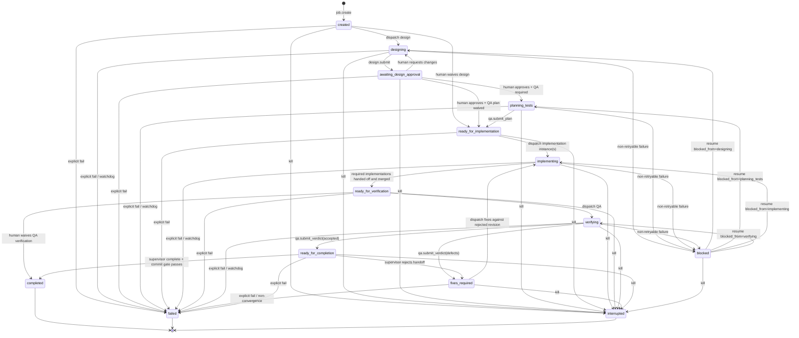
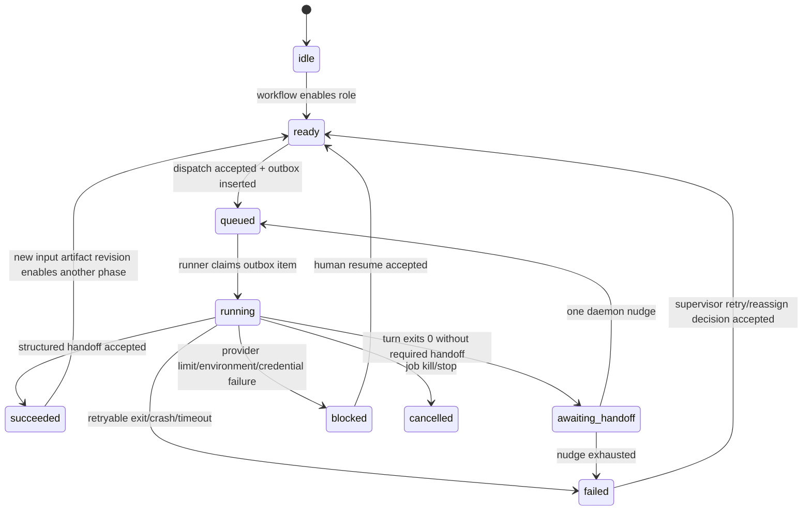

# 永続ワークフロー状態機械 設計案

## 1. 目的

agvsr の進行制御を、メッセージ本文と daemon のメモリ状態からの推測ではなく、SQLite に
永続化した状態とイベントに基づいて行う。

主な目的は次のとおり。

- 同じ役割への重複 dispatch を、依頼文の違いに関係なく機械的に防ぐ。
- design、approval、implementation、QA の依存関係を daemon が保証する。
- daemon 再起動後も、実行中・待機中・blocked の位置を復元する。
- 同じ成果物 revision に対する重複実装・重複 QA を防ぐ。
- provider 利用枠、環境障害、worker failure を区別し、無意味な retry を防ぐ。
- implementation の複数 instance と、軽量ジョブでの工程省略を表現する。

状態の所有者は agent ではなく daemon とする。agent は構造化イベントを要求し、daemon が
現在状態とガードを検証したうえで状態を変更する。

## 2. 設計原則

### 2.1 3層に分ける

単一の巨大な enum ではなく、以下を独立して保存する。

1. **Workflow phase**: ジョブ全体がどの工程にいるか。
2. **Role execution**: 各 role/instance の実行状態。
3. **Artifact revision**: design、implementation、QA が何を対象にしたか。

この分離により、たとえば workflow は `implementing` のまま、`implementation-1` は
`succeeded`、`implementation-2` は `running` と表現できる。

### 2.2 メッセージは証跡であり、状態の正本ではない

`message.body` の「完了」「approved」「defects」などを正規表現で解釈して状態を決めない。
既存メッセージは人間向け監査ログとして残すが、遷移には構造化された daemon API/event を
使用する。

### 2.3 状態更新と outbox 書き込みを同一トランザクションにする

状態更新後、プロセス停止前に dispatch を失う問題を避けるため、状態変更と dispatch outbox
追加を1つのSQLite transactionで行う。実際の agent 起動はcommit後にoutboxを処理する。

### 2.4 「順番の固定」ではなく「許可される遷移」を定義する

標準フローは design → approval → QA plan → implementation → QA verification だが、軽量ジョブ
では人間が工程を明示的にwaiveできる。agent自身の判断で工程を黙って省略することはできない。

## 3. 状態モデル

### 3.1 Workflow phase

```text
created
designing
awaiting_design_approval
planning_tests
ready_for_implementation
implementing
ready_for_verification
verifying
fixes_required
ready_for_completion
blocked
completed
failed
interrupted
```

`blocked` は元のphaseを失わない。`blocked_from_phase` と `blocked_reason` を別列に保存し、resume時
に元のphaseへ戻す。

### 3.2 Role execution state

role名ではなく role instance 単位で保存する。例: `supervisor`、`design`、`qa`、
`implementation-1`。

```text
idle
ready
queued
running
awaiting_handoff
succeeded
blocked
failed
cancelled
```

- `ready`: workflow上、このroleを起動可能。
- `queued`: outboxへ登録済みで、まだprocessを起動していない。
- `running`: adapter processが実行中。
- `awaiting_handoff`: turnは終了したが、必須の構造化handoffがない。
- `succeeded`: 対象revisionに対する役割の責務を完了。
- `blocked`: provider limit、credential、環境障害など、retryしても解消しない状態。
- `failed`: retry可能性を評価すべき通常失敗。自動retryを意味しない。

### 3.3 Artifact kind と revision

```text
goal_spec
design
test_plan
implementation
qa_verdict
```

revisionは単なる連番ではなく、不変の入力識別子を持つ。

- design: design handoff message、文書path、commit SHA
- test plan: 対象design revision、文書path、commit SHA
- implementation: merge済みcommit SHA集合またはjob branch tree SHA
- QA verdict: 対象implementation revision、対象test-plan revision、verdict

QA再実行は「前回と異なるimplementation revision」が存在する場合だけ許可する。同じcommitに
対して指示文を変えただけでは、新しいverificationを開始できない。

## 4. ジョブ全体の状態遷移



## 5. Role execution の状態遷移



同じrole instanceで `queued`、`running`、`awaiting_handoff`、`blocked` のいずれかにある間は、
追加の通常dispatchを拒否する。補足情報は agent turnを増やさず、後述のpending contextへ統合する。

## 6. 標準フローとガード

| 操作                    | 許可されるworkflow                           | 必須条件                                        | 遷移                                              |
| ----------------------- | -------------------------------------------- | ----------------------------------------------- | ------------------------------------------------- |
| design dispatch         | `created`, `designing`                       | designがactiveでない                            | `designing`                                       |
| design submit           | `designing`                                  | commit済みdesign artifact                       | `awaiting_design_approval`                        |
| approve design          | `awaiting_design_approval`                   | 対象design revision一致                         | `planning_tests`または`ready_for_implementation`  |
| QA plan dispatch        | `planning_tests`                             | QAがactiveでない、design revision一致           | roleを`queued`                                    |
| QA plan submit          | `planning_tests`                             | test plan commit、design revision一致           | `ready_for_implementation`                        |
| implementation dispatch | `ready_for_implementation`, `fixes_required` | approval済みdesign、必要ならtest plan           | `implementing`                                    |
| implementation submit   | `implementing`                               | commit SHA、dirty worktreeなし                  | 全required instance完了後`ready_for_verification` |
| QA verify dispatch      | `ready_for_verification`                     | 新しいimplementation revision、QAがactiveでない | `verifying`                                       |
| QA accepted             | `verifying`                                  | verification対象revision一致                    | `ready_for_completion`                            |
| QA defects              | `verifying`                                  | 再現情報、対象revision一致                      | `fixes_required`                                  |
| supervisor complete     | `ready_for_completion`                       | QA accepted、commit gate通過                    | `completed`                                       |
| retry                   | role=`failed`                                | failureがretryable                              | role=`ready`                                      |
| resume                  | workflow/role=`blocked`                      | humanのみ、block token一致                      | 元のphase/`ready`                                 |

`completed`への遷移では既存commit gateも同じtransaction内で再確認する。

## 7. QAの2フェーズ制御

QAだけを特別扱いするのではなく、汎用状態機械のartifact依存として表現する。

### 7.1 Planning

- 入力: approved design revision
- 出力: test plan revision
- 同じdesign revisionに対して原則1回だけ。
- designが変更された場合は新しいplanningを許可する。

### 7.2 Verification

- 入力: test plan revision + implementation revision
- 出力: `accepted` または `defects`
- `verifying`中の追加QA dispatchは文面に関係なく拒否する。
- `defects`後は、implementationが新しいrevisionをsubmitするまで再QA不可。
- accepted済みのimplementation revisionへの再QAは、人間による明示override以外は不可。

QAへの補足依頼が到着した場合、roleがまだ`queued`ならoutbox payloadへ統合できる。`running`後は
`pending_context`へ保存し、次の正規のturnが存在するときだけ入力へ追加する。補足だけを理由に
新しいturnを起動しない。

## 8. 失敗分類

| 分類             | 例                                           |              自動retry | 状態                           |
| ---------------- | -------------------------------------------- | ---------------------: | ------------------------------ |
| provider_limit   | 5h/monthly spend/rate/quota limit            |                   禁止 | `blocked`                      |
| credential       | API key、秘密鍵、RPC credential欠如          |                   禁止 | `blocked`                      |
| environment      | read-only FS、壊れたinstall、binary mismatch |                   禁止 | `blocked`                      |
| timeout          | hard/idle timeout                            | 禁止（supervisor判断） | `failed`                       |
| transient_worker | process spawn、一時的tool error              | 禁止（supervisor判断） | `failed`                       |
| config           | unknown/unsupported model                    |                   禁止 | `blocked`                      |
| validation       | test failure、QA defect                      |  retryではなく修正工程 | `fixes_required`または`failed` |

「自動retry禁止」は、supervisorによる無制限retryも許すという意味ではない。`failed → ready`には
構造化されたretry decisionを要求し、同一failure fingerprintのattempt上限を適用する。

## 9. 構造化イベント/API

最小限、次の操作を導入する。

```text
workflow.design_submit(job_id, artifact, expected_version)
workflow.design_decide(job_id, design_revision, decision, expected_version)
workflow.qa_plan_submit(job_id, artifact, design_revision, expected_version)
workflow.implementation_submit(job_id, artifact, design_revision, expected_version)
workflow.qa_verdict_submit(job_id, implementation_revision, verdict, report, expected_version)
workflow.retry(job_id, role_instance, failure_id, expected_version)
workflow.block(job_id, role_instance, classification, reason, expected_version)
workflow.resume(job_id, block_id, expected_version)
workflow.waive(job_id, phase, reason, expected_version)  // human only
```

`expected_version`によるoptimistic concurrency controlを必須にする。競合時は
`state_conflict`を返し、agentに最新状態の再取得を要求する。

既存の`msg.send`は会話・補足情報用として残すが、workflow遷移やworker起動には使わない。
移行期間中のみ、daemonが旧`msg.send`を対応する構造化操作へ変換するcompatibility layerを置く。

## 10. 永続化スキーマ案

```sql
CREATE TABLE job_workflow_state (
  job_id TEXT PRIMARY KEY REFERENCES jobs(id),
  phase TEXT NOT NULL,
  version INTEGER NOT NULL DEFAULT 0,
  active_design_revision_id TEXT,
  active_test_plan_revision_id TEXT,
  active_implementation_revision_id TEXT,
  blocked_from_phase TEXT,
  blocked_reason TEXT,
  created_at TEXT NOT NULL,
  updated_at TEXT NOT NULL
);

CREATE TABLE role_execution_state (
  job_id TEXT NOT NULL REFERENCES jobs(id),
  role_instance TEXT NOT NULL,
  phase_kind TEXT NOT NULL,
  state TEXT NOT NULL,
  attempt INTEGER NOT NULL DEFAULT 0,
  dispatch_id TEXT,
  input_revision_id TEXT,
  output_revision_id TEXT,
  failure_id TEXT,
  started_at TEXT,
  finished_at TEXT,
  updated_at TEXT NOT NULL,
  PRIMARY KEY (job_id, role_instance, phase_kind)
);

CREATE TABLE workflow_artifact_revision (
  id TEXT PRIMARY KEY,
  job_id TEXT NOT NULL REFERENCES jobs(id),
  kind TEXT NOT NULL,
  revision INTEGER NOT NULL,
  parent_revision_id TEXT,
  message_id TEXT,
  commit_sha TEXT,
  tree_sha TEXT,
  refs_json TEXT NOT NULL,
  created_by_role TEXT NOT NULL,
  created_at TEXT NOT NULL,
  UNIQUE (job_id, kind, revision)
);

CREATE TABLE workflow_event (
  id TEXT PRIMARY KEY,
  job_id TEXT NOT NULL REFERENCES jobs(id),
  sequence INTEGER NOT NULL,
  event_type TEXT NOT NULL,
  actor TEXT NOT NULL,
  payload_json TEXT NOT NULL,
  created_at TEXT NOT NULL,
  UNIQUE (job_id, sequence)
);

CREATE TABLE dispatch_outbox (
  id TEXT PRIMARY KEY,
  job_id TEXT NOT NULL REFERENCES jobs(id),
  role_instance TEXT NOT NULL,
  workflow_version INTEGER NOT NULL,
  payload_json TEXT NOT NULL,
  state TEXT NOT NULL,
  claimed_at TEXT,
  completed_at TEXT,
  created_at TEXT NOT NULL
);
```

`workflow_event`は監査と障害解析に使う。通常の状態復元はsnapshot tableである
`job_workflow_state`と`role_execution_state`から行い、毎回event replayはしない。

## 11. Hookとトランザクション境界

### 11.1 pre-transition hook

状態変更前に、現在version、許可遷移、actor権限、入力artifact revision、active dispatch有無を
検証する。失敗時はmessageもoutboxも保存しない。

### 11.2 commit hook

1つのtransactionで以下を実行する。

1. workflow/role state更新
2. artifact/event/message保存
3. 必要ならdispatch outbox追加
4. workflow version加算

### 11.3 post-commit hook

commit後にoutbox workerをwakeする。通知、Herdr prompt、WebSocket pushもpost-commitで行う。
外部副作用が失敗しても状態transactionをrollbackせず、outboxから再送する。

### 11.4 turn lifecycle hook

- claim: `queued → running`
- structured handoff: `running → succeeded`
- exit 0 without handoff: `running → awaiting_handoff`
- retryable failure: `running → failed`
- non-retryable failure: `running → blocked`かつworkflow=`blocked`
- kill: active roleを`cancelled`、workflow=`interrupted`

## 12. 再起動時の復旧

daemon起動時に、terminalでないジョブを走査する。

- `queued`: 未claimまたはlease期限切れならoutboxから起動。
- `running`: 実processはdaemonを跨げないため、`failed`へせず`blocked`へ移し、
  `daemon_restarted_during_turn`として人間へ通知する。
- `awaiting_handoff`: nudge済み回数を保持し、残り回数だけ許可する。
- `blocked`: 自動起動しない。
- `ready`: 自動起動しない。既存outboxがある場合だけ処理する。

起動時に「running jobを一律interrupted」にする現在の挙動は、workflow状態導入後に上記へ置き換える。

## 13. Multi-instance implementation

workflow=`implementing`の下で、各instanceを独立管理する。

```text
implementation-1: succeeded -> revision A
implementation-2: running
implementation-3: failed
```

設計時にrequired instance集合とmerge policyをsnapshotする。全required instanceが`succeeded`し、
各branchがjob branchへmergeされ、最終tree SHAが確定した時点で1つのimplementation revisionを
作成して`ready_for_verification`へ進む。

一部instanceを不要と判断する場合は、supervisorの自然言語判断ではなく、人間または許可された
policyによる`cancel_instance`イベントを記録する。

## 14. 既存機能との対応

| 現在の仕組み                       | 移行後                                                     |
| ---------------------------------- | ---------------------------------------------------------- |
| `jobs.status`                      | terminal outcomeとして維持。詳細進行はworkflow phaseへ分離 |
| `inflight` Map                     | 実process handle用途のみ。正本はrole execution + outbox    |
| `failureCounts` Map                | role execution attempt/failure eventへ永続化               |
| `sessions` Map                     | 既存agent session tableを継続利用                          |
| message履歴からdesign approval推測 | design revisionに対する構造化decision                      |
| 同一本文による重複QA検出           | role stateとinput revisionによる排他                       |
| Tier1/Tier2 watchdog               | failure fingerprintとattempt policyへ統合                  |
| commit gate                        | implementation submit/completed遷移のguardとして維持       |

## 15. 導入段階

### Phase 1: 観測のみ

- 新テーブルとevent記録を追加。
- 既存制御は変えず、shadow stateを計算してログとの差異を検出。

### Phase 2: Role排他とoutbox

- 全roleの`ready/queued/running`を永続化。
- active roleへの重複dispatchを機械的に拒否。
- daemon再起動時の二重dispatchを防止。

### Phase 3: Artifact revisionとQA制御

- design/test plan/implementation/QA verdictを構造化。
- 同一revisionへの重複QAと、修正なし再QAを拒否。

### Phase 4: Workflow gate移行

- design approval、implementation handoff、completion gateをworkflowへ統合。
- 旧message推測ロジックをcompatibility layer経由に限定。

### Phase 5: 旧制御削除

- shadow/compatibility metricsで不一致がなくなった後、メモリのみのcounterと本文推測を削除。

## 16. 必須テスト

- 同一roleへ文面の異なる依頼を連続送信しても1turnだけ起動される。
- queued/running中の補足情報が新turnを起動しない。
- design revisionなしにQA planningを起動できない。
- implementation revisionなしにQA verificationを起動できない。
- defects後、同一implementation revisionでは再QAできない。
- 新しいimplementation revision後は再QAできる。
- provider limit後は自動retryされず、再起動後もblockedを維持する。
- daemonをqueued/running/outbox commit直後の各地点で停止しても二重dispatchしない。
- optimistic lock競合時に片方だけが遷移成功する。
- implementation複数instanceの一部完了ではverificationへ進まない。
- compatibility layer経由と新API経由で同じ最終状態になる。
- state、event、message、outboxがtransaction境界で部分保存されない。

## 17. 採用判断と未決事項

この設計では以下を採用する。

- 全roleの状態をdaemonが永続化する。
- workflow、role execution、artifact revisionを分離する。
- roleがactiveな間は、文面によらず追加dispatchを拒否する。
- provider limit等はblockedとして保存し、人間だけがresumeできる。
- QA再実行可否はimplementation revisionで判定する。
- 状態更新とdispatch outboxを同一transactionにする。

実装前に決める必要がある事項は以下。

1. `created`からdesignを省略できる軽量ジョブの判定を、人間指定だけにするかpolicy化するか。
2. `planning_tests`をdesign approvalの前後どちらに置くか。本案はapproval後とした。承認前の設計に
   QAコストを使わず、承認変更によるtest plan作り直しを避けるためである。
3. running中に届いた補足情報を次の正規turnへ統合するか、単に拒否してsupervisorへ返すか。
4. daemon再起動中だったturnを`blocked`にするか、adapterごとにsession resumeを許可するか。
5. supervisor自身の連続turnを、通常workerと同じrole排他で制御するか、専用event loopへ移すか。
